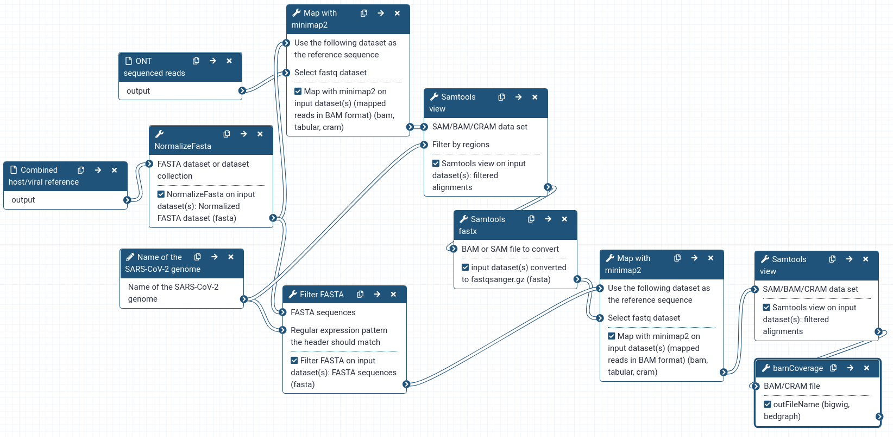

## Live Resources

| usegalaxy.eu |
|:--------:|:------------:|:------------:|:------------:|:------------:|
| <FlatShield label="workflow" message="run" href="https://usegalaxy.eu/u/wolfgang-maier/w/sars-cov-2-assign-ont-reads-to-transcripts-mapping" alt="Galaxy workflow" /> |
| |

## Overview

A first challenge with sequencing data from cultured virus isolates is that this data will contain sequenced reads of both viral and host cell origin.
Hence, the preprocessing workflow described here serves the purpose of identifying and extracting reads of viral origin from a first round of mapping to a combined viral/host reference.
The read mapper `minimap2` is used here and configured to allow gapped alignments to reflect the transcriptomic nature of the RNAseq data.
Identified viral reads are then realigned to only the viral genome using `minimap2` again, but with mapper settings optimized to produce correct alignments for reads spanning the junction sites present in the SARS-CoV-2 sgRNAs.

## Inputs

### Reference sequence

| usegalaxy.eu |
|:--------:|:------------:|:------------:|:------------:|:------------:|
| <FlatShield label="history" message="view" href="https://usegalaxy.eu/u/wolfgang-maier/h/sars-cov-2human-combined-ont-reference" alt="Galaxy history" /> |
| |

This history features a combined reference of

- the human host (`hg38` reference and human ribosomal sequence `U13369.1`)
- the SARS-CoV-2 `NC_045512.2` reference sequence
- the yeast `ENO1` sequence used in the ONT sequencing protocol

To generate a combined reference adjusted to any non-human host cell used for culturing the virus, the last two steps in this history can simply be rerun using a different host reference.

The workflow also requires you to specify the name of the SARS-CoV-2 sequence in the combined genome.
This is necessary to extract the sequence for the viral genome-specific mapping step.
If you are using the combined reference from our history or build your own using the SARS-CoV-2 genome provided in the history, that name is `NC_045512.2`.

### ONT-sequenced reads

A single uncompressed or compressed FASTQ dataset with the sequenced reads of a single sample is expected.
Please make sure to set the Galaxy datatype of this dataset to `fastqsanger`, `fastqsanger.gz` or `fastqsanger.bz2` as appropriate.

## Outputs

The workflow produces a `Mapped viral reads` output dataset with the (primary, possibly gapped) alignments of all reads that mapped to the viral reference. In addition, it produces a `Viral reads coverage` dataset in `bigwig` format.

