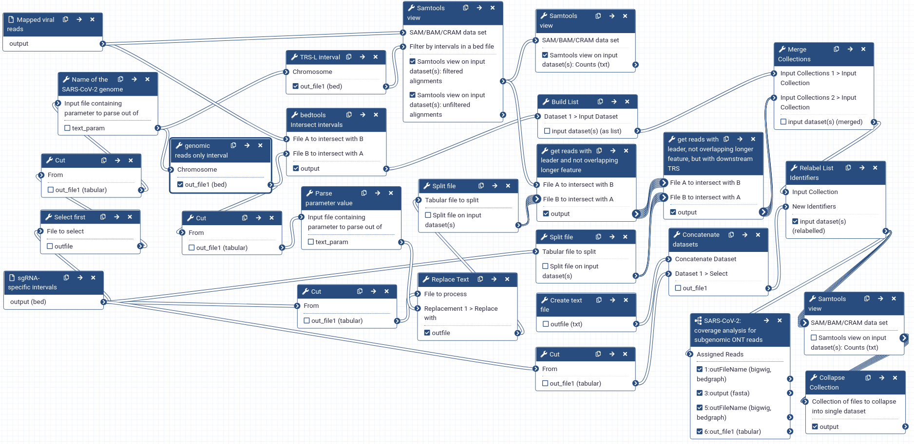

## Live Resources

| usegalaxy.eu |
|:--------:|:------------:|:------------:|:------------:|:------------:|
| <FlatShield label="Mapped reads classification workflow" message="run" href="https://usegalaxy.eu/u/wolfgang-maier/w/sars-cov-2-classify-ont-reads-by-transcript-junctions" alt="Galaxy workflow" />|
| |

## Overview

Transcription of the viral genome yields an overlapping set of sub-genomic RNAs (sgRNAs) that encode viral structural proteins.
Each sgRNA carries a common 5' leader sequence ending in a so-called TRS-L motif, which gets joined during transcription to downstream, sgRNA-specific TRS-B sites.
For sequenced reads with a 5' leader sequence, the 3' part of the sequence around the transcriptional junction can, thus, be used to classify these reads as being derived from specific transcripts.

The workflow extracts reads with viral leader sequence from a superset of premapped viral reads and classifies them according to the overlap between their 3' junctions sites and a user-defined set of candidate junction regions.

In our [published analysis](https://doi.org/10.1101/2020.07.18.204362) we used two subsequent runs of the workflow with different sets of candidate TRS-B regions.
The (preliminary) read classification from the first run was used to identify functional TRS-B motifs from junction events in wide candidate regions (we used [IGV](http://software.broadinstitute.org/software/igv/home) for this purpose).
In the second run we used narrowly defined regions around the observed TRS-B motifs for the more stringent final classification. 

## Inputs

1. The `Mapped viral reads` dataset generated during [preprocessing](../1-preprocessing)
2. An `sgRNA-specific intervals dataset` in `bed` format listing candidate TRS-B regions to be used for the reads classification

   The regions used in our [published analysis](https://doi.org/10.1101/2020.07.18.204362) to *discover* transcripts and corresponding TRS-B motifs can be found [here](trsb-discovery.bed).

   Our list of confirmed TRS-B sites that we used for quantification and for final classification of transcripts is available [here](trsb-confirmed.bed).

   :warning: The reference name listed in the first column of the interval dataset needs to match the SARS-CoV-2 reference name used at the read mapping stage! If you have used our [suggested](../1-preprocessing#reference-sequence) SARS-CoV-2 reference, that name is `NC_045512.2`.

## Additional configuration options

In addition to the TRS-B regions interval dataset above, the workflow uses two more, preconfigured intervals, which can be adjusted, if desired, by changing the parameters of the following workflow steps:

- *TRS-L interval*

  This is the interval reads have to show overlap with to be classified as *reads with leader sequence*.
  Only reads with a leader sequence are considered during transcript classification.

- *genomic reads only interval*

  This interval defines the region that *no* sgRNA is supposed to overlap.
  Conversely, reads that show significant overlap with this region (where "significant" is defined in the subsequent *bedtools intersect intervals* step) are classified as *genomic* reads.

To classify any read as being derived from a particular sgRNA, it has to align to the *TRS-L interval* and to the specified TRS-B region for that sgRNA, but must display an alignment gap across the region between the start of the *genomic reads only interval* and the start of the sgRNA-specific TRS-B region.

## Outputs

The main outputs of the workflow are:

1. Three interval datasets in `bed` format reporting the TRS-L interval, the interval used for classifying reads as genomic, and the sgRNA-specific exclusion regions (which specific sgRNAs are not supposed to overlap with) used in the analysis

2. Two new `bam` datasets of *viral reads with and without leader sequence*
3. A collection of `bam` datasets representing the *completed assignment of reads to full genome and subgenomic features*

  Each dataset in this collection holds one class of aligned reads - either potential genomic reads (those with overlap with ORF1ab genomic sequence) or reads from one of the sgRNAs as defined by the input intervals.

4. A `tabular` dataset with the *counts of reads per sgRNA

- a collection of `bigwig` coverage datasets, one per read class
